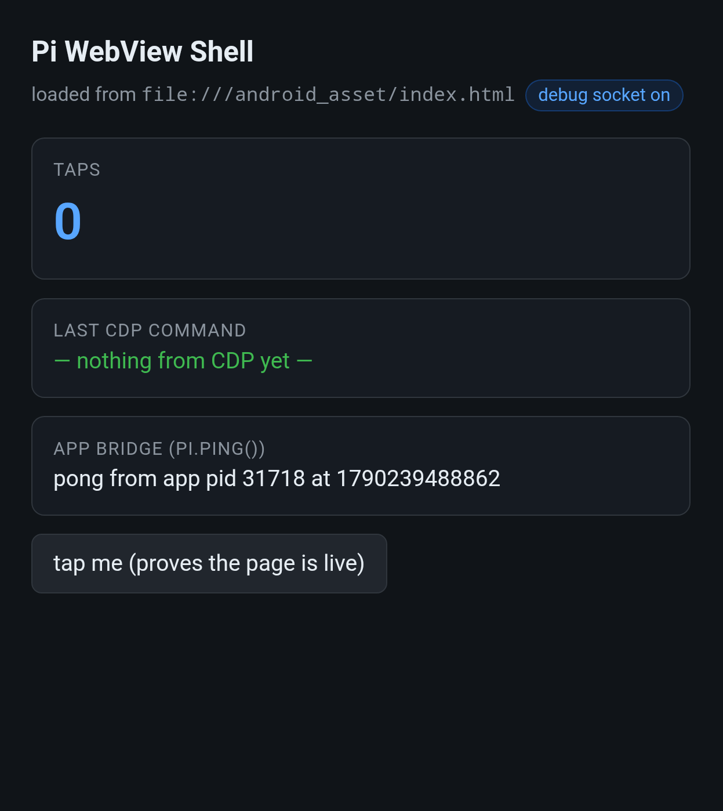
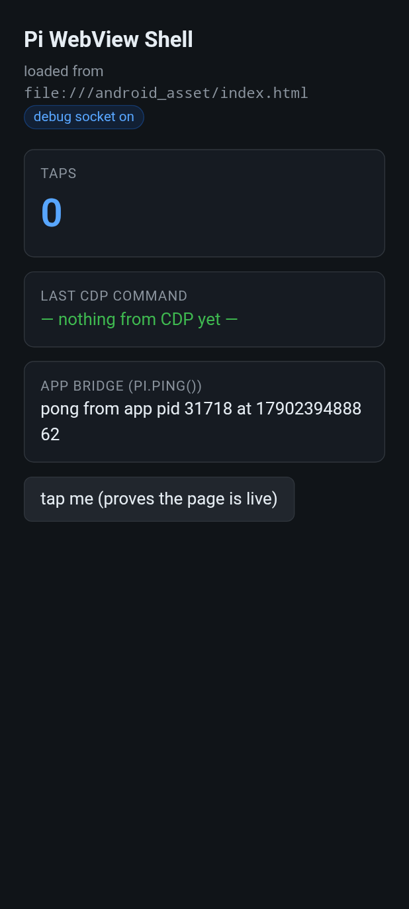
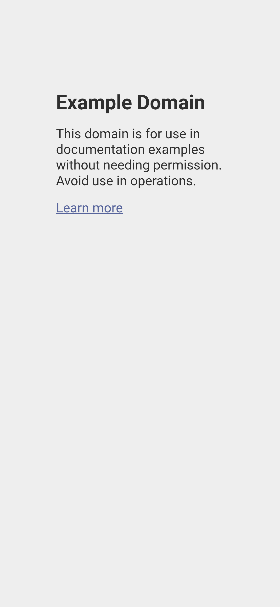
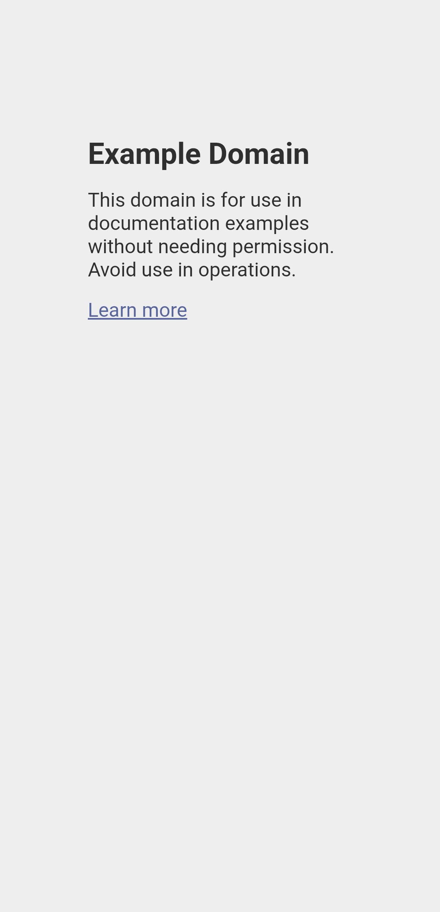

# Pi WebView Shell

A 16 KB single-Activity Android app that hosts a **WebView you can drive over the
Chrome DevTools Protocol from Termux** — plus the Termux-side tooling to do it.
Built on-device, no Gradle, no Android SDK — a hand-rolled `build.sh`
(aapt2 → javac → d8 → apksigner).

Verified end-to-end on SM-F936B (One UI, Android 16 / API 36), 2026-09.

## How it works

```
Termux (node / python / curl)                     the app process (pid N)
  │                                                     │
  │ HTTP + WS on 127.0.0.1:9333                         │  WebView DevTools server
  ▼                                                     ▼
adb server (running INSIDE Termux) ── adb forward ──► @webview_devtools_remote_N
```

`WebView.setWebContentsDebuggingEnabled(true)` makes WebView expose CDP on an
**abstract unix socket** named `webview_devtools_remote_<pid>`.

You cannot connect to that socket from Termux directly: SELinux blocks one app
from connecting to another app's socket (`EACCES`), and the shell UID (i.e.
Shizuku) is refused too. `adbd` *is* allowed, so `adb forward` is the way in —
and because Termux's own adb server runs on the device, the forwarded port lands
on the **device's own loopback**.

## Screenshots

All of these are produced **by the tool itself** — `node cdp.mjs --shot`, i.e. the same
`Page.captureScreenshot` path documented below, not a phone screenshot:

**The shell on a virtual display** (1247×1398 px):



**The same page under `--device pixel-7`** — the page lays out at 412×915 CSS px with touch
and a mobile UA (scale factor clamped to 1.5 here; see *Phone-sized viewports*):



**A real site at `--device iphone-14`** — 390×844 CSS px, driven and captured over the relay
with no adb forward:



**No emulation at all** — example.com in the shell on a simulated phone display
(`./display.sh overlay`), captured at the display's native 1082×2237:



## Prerequisites — setting up a fresh Android device

### The whole thing, scripted

```bash
# 1. Termux (required) — from F-Droid or GitHub releases, not the Play Store
# 2. get the code
gh repo clone jan5o7o/webview-shell && cd webview-shell   # or: git clone https://github.com/jan5o7o/webview-shell.git
# 3. READ-ONLY checkup: prints what is missing and the exact command to fix each item
bash ./setup.sh --pre-install-checkup
# 4. do what it says, then build + install + verify in one pass
bash ./setup.sh
```

`setup.sh` is idempotent and covers the traps a fresh machine hits: missing Termux packages
(including **`zip`**, which is a separate package from `unzip` and easy to miss), the 27 MB
platform jar that is deliberately not in the repo, and the signature clash from a fresh
checkout (no signing key is committed, so it uninstalls the old copy and reinstalls). It ends
with an unambiguous verdict, and in checkup mode it writes nothing at all.

Run it as `bash ./setup.sh` — the shebang is a Termux absolute path, so that form also keeps
working if you are on a laptop with a USB phone.

> **See it done for real:** [*A real run, start to finish*](#a-real-run-start-to-finish) below
> walks the whole thing on a phone that had nothing but Termux installed, including the adb
> pairing that actually gave trouble.

**What it cannot do** (it says so, and tells you who can):

| not scriptable | why |
|---|---|
| install Termux | you are reading this from Termux; it is the one hard prerequisite |
| enable Developer options / Wireless debugging | Settings UI only |
| `adb pair` the device | one-time, needs the pairing code on screen |

### The device

- **Android 14+ (API 34+).** `build.sh` declares `minSdk 30`, but the keep-alive service
  uses `foregroundServiceType="specialUse"`, which only exists from API 34 — treat 14 as the
  real floor. Verified on Android 16 / One UI (SM-F936B); **not tested on anything older.**
- **A current WebView provider** (Chrome, or Google's standalone WebView). The CDP version
  you get comes from it — this device reports `Chrome/153`, protocol 1.3.
- Nothing else. No root, no Shizuku, no accessibility service. The relay means you never even
  need adb *after launch*.

### Termux and the build tools

Install **Termux from F-Droid or GitHub releases** — the Play Store build is deprecated and stale.

```bash
pkg update && pkg upgrade
pkg install aapt2 d8 apksigner openjdk-21 android-tools nodejs-lts python3 zip unzip curl
```

| need | package | provides |
|---|---|---|
| resource/manifest compiler | `aapt2` | `aapt2` |
| dexer | `d8` | `d8` |
| signing | `apksigner` | `apksigner` |
| javac / keytool | `openjdk-21` | `javac`, `keytool` (21.0.12 here) |
| adb | `android-tools` | `adb` 1.0.41 / 35.0.2 |
| CDP client | `nodejs-lts` | `node` (needs **22+** for the built-in `WebSocket`) |
| jar extraction | `unzip` | `unzip` |
| **packaging** | `zip` | `build.sh` adds `classes.dex` with `zip` — a *separate* package from `unzip` |
| helper scripts | `python3`, `curl` | used by `cdp-webview.sh` / `display.sh` |

`aidl` is **not** needed here.

### The platform jar (27 MB, not in this repo)

```bash
curl -LO https://dl.google.com/android/repository/platform-36_r02.zip   # HTTP 200, verified
unzip -j platform-36_r02.zip android-36/android.jar -d sdk/platforms/android-36/
```

Sanity check: that jar is ~27,768,000 bytes. `build.sh` looks for it at
`sdk/platforms/android-36/android.jar`.

### Wireless ADB, from Termux on the same device

Because Termux runs *on* the phone, its **adb server runs inside Termux** — which is why
`adb forward` lands on the device's own loopback and every CDP path here is `127.0.0.1`.

1. Settings → About phone → tap **Build number** 7× → Developer options.
2. **Wireless debugging** → on → *Pair device with pairing code*; note the IP:port **and the code**.
3. `adb pair 192.168.x.y:<pair-port>` — asks for the code; once per device.
4. `adb connect 192.168.x.y:<connect-port>` — the port shown on the Wireless debugging screen,
   which **changes every time you toggle it**.

Notes worth having in advance:
- On the same device, `adb connect 127.0.0.1:<port>` also works (verified) — no IP needed.
- `adb mdns services` does **not** work with Termux's `android-tools` build
  (`error: unknown host service 'mdns:services'`). Read the port off the screen, or discover
  it over mDNS (`_adb-tls-connect._tcp`) with any zeroconf client.
- Transports are ambiguous with more than one connection — use `adb -s <host:port>`.

### Build, install, first run

By hand:

```bash
./build.sh
adb install -r out/pi-webview.apk
adb shell am start -n com.pi.webview/.MainActivity          # or --display <id>
./cdp-webview.sh direct                                     # relay on 9334, no forward
node cdp.mjs --device pixel-7 'document.title'
```

**If the app is already installed by someone else's build, uninstall it first:**

```bash
adb uninstall com.pi.webview     # INSTALL_FAILED_UPDATE_INCOMPATIBLE otherwise
```

There is deliberately **no signing key in this repo** — `build.sh` generates `keystore.jks` on
first use. So a fresh clone signs with a *new* key, and Android refuses to replace an
installed app whose signature differs. Uninstalling costs nothing here (the app stores no data).

Android 13+ will ask for **notification permission**: it belongs to the keep-alive foreground
service, which is what stops the platform freezing the process (see *The freeze problem*).
`bash ./setup.sh` does all of the above plus the checks, and grants that permission for you.

### Verifying it worked

Each step has an unambiguous check — useful when an agent is driving:

| step | check | expected |
|---|---|---|
| build | `ls -l out/pi-webview.apk` | ~20 KB file |
| installed | `adb shell pm list packages \| grep com.pi.webview` | `package:com.pi.webview` |
| running | `adb shell pidof com.pi.webview` | a pid |
| relay | `./cdp-webview.sh direct` | `relay UP on 127.0.0.1:9334` |
| CDP | `node cdp.mjs 'document.title'` | `Pi WebView Shell` |
| input | `node cdp.mjs --click 'text=tap me'` then `node cdp.mjs '__pi.taps()'` | counter +1 |
| capture | `node cdp.mjs --shot shot.png` | PNG written, non-zero |
| off-screen | `./display.sh overlay` | a display id and `411x851` CSS |

### If the agent is not running in Termux on the phone

Everything is designed for Termux-on-device, but an agent on a laptop with a USB phone works
with two adjustments:

- **Invoke the scripts as `bash build.sh`.** Their shebangs are absolute Termux paths
  (`#!/data/data/com.termux/files/usr/bin/bash`), which do not exist on a laptop.
- **Reach the relay with a TCP forward**: `adb forward tcp:9334 tcp:9334`. That forwards to the
  *device's* loopback, where the relay listens, so the CDP client runs happily on the laptop
  (verified: `curl 127.0.0.1:9444/json/version` through a forward returns this app's
  DevTools handshake). `display.sh overlay` also works from off-device — it is only `adb`
  writing a setting.

Clone with `gh repo clone` or plain `git clone` (a private repo would also need auth).


## A real run, start to finish

This is the whole flow as it actually went on a phone that had never seen this repo — a Galaxy
Z Fold on Android 16 with Termux installed and nothing else. Output is trimmed, but the
awkward parts are kept on purpose. Nothing but Termux was installed on it, to prove the flow
stands on its own.

### 0. What you need before you start (not scriptable)

| | why |
|---|---|
| Termux (F-Droid / GitHub releases) | everything below runs inside it |
| Developer options + **Wireless debugging** on | adb is how the APK gets installed |
| the **pairing code**, read off the screen | once per device; only a human can see it |

### 1. Get the code

```bash
gh repo clone jan5o7o/webview-shell && cd webview-shell
```

### 2. Pre-install checkup (writes nothing)

```bash
bash ./setup.sh --pre-install-checkup
```

On this phone it failed — correctly, and usefully:

```
== android platform jar
  FAIL  sdk/platforms/android-36/android.jar missing (27 MB platform jar, deliberately not in the repo)

== adb
  FAIL  no device connected
        On the phone: Settings → About phone → tap Build number 7× →
        Developer options → Wireless debugging → on → 'Pair device with pairing code'.

Do this next:
  1. curl -LO https://dl.google.com/android/repository/platform-36_r02.zip && unzip -j …
  2. adb pair <ip>:<pair-port>     # once per device; the code is on the Wireless debugging screen
  3. adb connect <ip>:<connect-port>   # changes every time Wireless debugging is toggled; 127.0.0.1:<port> works on-device

Not ready. Fix the items above, then re-run: bash ./setup.sh --pre-install-checkup
```

### 3. Fix 1 — the adb connection (the fiddly part)

Everything about this was harder than it should be, in ways worth knowing:

- The phone **changed networks during the session**, so its IP moved `192.168.1.172` →
  `10.76.185.111` → `192.168.100.20`. The mDNS records went stale with it: the advertised
  **connect ports were refused** while a different port actually answered.
- **Pairing and connecting use different ports.** Attempting `adb pair` on the connect port
  gives `error: protocol fault (couldn't read status message)` — only the pairing port speaks
  that protocol. And a plain `adb connect` at a port that answers but is not accepting
  connections leaves an **`offline` transport** rather than a clean error, which looks like a
  broken device until you clear it (`adb kill-server`, or `adb disconnect <addr>`).
- `adb mdns services` does **not** work with Termux's `android-tools` build
  (`error: unknown host service 'mdns:services'`), so a zeroconf client is the way to find the
  live ports — including `_adb-tls-pairing._tcp`, which is what hands you the pairing port
  while the dialog is open.
- Because Termux runs *on* the phone, `127.0.0.1:<port>` reaches adbd and sidesteps the
  network churn completely.

So, in practice:

```bash
$ python3 ~/adbdiscover.py                     # or any mDNS/zeroconf client
FOUND adb-RFCTB158WFJ-hNiWLk._adb-tls-pairing._tcp.local.  ['192.168.100.20', …] 37991
FOUND adb-RFCTB158WFJ-hNiWLk._adb-tls-connect._tcp.local.  ['192.168.100.20', …] 41373
FOUND adb-RFCTB158WFJ-hNiWLk (3)._adb-tls-connect…         ['192.168.100.20', …] 40855

$ adb pair 127.0.0.1:37991 460835
Successfully paired to 127.0.0.1:37991 [guid=adb-RFCTB158WFJ-hNiWLk]

$ adb connect 127.0.0.1:43803                  # the connect port that actually answered
connected to 127.0.0.1:43803

$ adb devices -l
127.0.0.1:43803   device product:q4qxxx model:SM_F936B device:q4q
```

### 4. Fix 2 — the platform jar: do nothing

`setup.sh` fetches it. With no jar anywhere on the device it downloaded the 27 MB archive
itself and extracted the jar — **27,768,026 bytes**, matching the documented size.

### 5. Build, install, verify

```bash
bash ./setup.sh
```

```
== install
  warn  signed differently from the installed copy (no keystore is committed) — uninstalling and reinstalling
  ok    installed (after uninstall)
  ok    notification permission granted

== launch and verify
  ok    relay answering on 127.0.0.1:9334 (no adb forward needed)
  ok    CDP round-trip: document.title = "Pi WebView Shell"
  ok    input injection: taps 0 → 1
  warn  screenshot not attempted: page is 'hidden', so there are no frames to capture
        pixels need a visible window — ./display.sh overlay gives one off-screen
```

The signature warning is expected on a fresh clone and handled automatically: no signing key is
committed, so `build.sh` generated one (`CN=Pi WebView`) and Android refused to update the
app installed from a different key — hence uninstall + reinstall.

The screenshot line is the other real behaviour: the page was **hidden** (its window was not on
screen), and a hidden page has no frames to capture. It is reported as skipped with the fix
rather than as a failure. Taking the advice:

### 6. Off-screen, phone-sized, with pixels

```bash
$ ./display.sh overlay
display id   41 (overlay, 1080x2340/420 — created via overlay_display_devices)
task         5334 sized to 1080x2340
viewport     {"css":"411x851","dpr":2.625,"px":"1079x2234"}
pixels       YES — renders off-screen; capture at the display size, no clamping
relay        UP on 127.0.0.1:9334 (no adb forward)

$ node cdp.mjs --shot clone-shot.png
screenshot -> clone-shot.png            # 1082x2237 PNG
```

### What that run proves

| | |
|---|---|
| root | not needed |
| Shizuku / accessibility service / any companion app | **not needed** — nothing else was installed |
| adb after launch | not needed — the relay served CDP throughout |
| human hands | developer options, the pairing code, and later the display toggle |
| wall-clock cost | dominated by the 27 MB jar download and the build; the pairing was the only fiddly part |

## Three layers of control

| Layer | Channel | What it can do | Needs |
|---|---|---|---|
| **Transport** | `adb forward tcp:9333 localabstract:…` | reach the socket at all | adb (already connected to itself) |
| **Page** | CDP over the forwarded port | DOM/CSS/JS, real mouse + key input, navigation, network, screenshots, console | nothing in the app |
| **App** | `@JavascriptInterface` bridge (`pi.*`), driven *through* CDP | anything the Java side exposes: Android APIs, app state | rebuild the app |

CDP is the only layer that needs no app cooperation, which is why it's the useful
one: you can point the same tooling at any WebView/Chrome.

## Use

```bash
cd ~/webview-shell
./build.sh                                  # aapt2 -> javac -> d8 -> check -> apksigner
adb install -r out/pi-webview.apk

./cdp-webview.sh up                         # (re)launch + unfreeze + forward + verify
./cdp-webview.sh status                     # pid, frozen?, forward, HTTP
./cdp-webview.sh info                       # page targets
./cdp-webview.sh down                       # remove the forward

node cdp.mjs 'document.title'               # evaluate in the page
node cdp.mjs --click 'button'               # real mouse input (or --click 'text=tap me')
node cdp.mjs --type 'hello'                 # insertText into the focused element
node cdp.mjs --key Enter                    # Enter Tab Escape Backspace Arrow… PageUp/Down
node cdp.mjs --nav https://example.com      # navigate + wait for load
node cdp.mjs --wait '#ready'                # poll for a selector
node cdp.mjs --shot page.png                # screenshot the page
node cdp.mjs --repl                         # interactive: .help .click .nav .shot .exit
node cdp.mjs 'pi.info()'                    # cross into the Android layer
```

Actions run in a fixed order (`nav → wait → click → type → key → expression → shot`),
so a single invocation can perform a whole sequence. `DEBUG=1` streams CDP events.

## Files

| File | Role |
|---|---|
| `java/com/pi/webview/MainActivity.java` | debug flag, WebView, `pi` JS bridge (`ping`/`info`/`toast`) |
| `java/com/pi/webview/KeepAliveService.java` | foreground service — keeps the process out of the frozen cgroup |
| `java/com/pi/webview/RelayServer.java` | publishes the socket on `127.0.0.1:9334` (no adb needed) |
| `assets/index.html` | demo page; exposes `window.__pi` as a stable CDP handle |
| `build.sh` | on-device build: aapt2 → javac → d8 → alignment check → apksigner |
| `cdp-webview.sh` | pid discovery, freeze handling, `adb forward`, verification |
| `cdp.mjs` | dependency-free CDP client/CLI (Node 22+ global `WebSocket`) |
| `display.sh` | put the shell on a simulated phone-sized display, off-screen |

`keystore.jks` is a throwaway dev key: `build.sh` generates it on first build, and it is never
committed.

## Running it off the phone screen (and testing at phone sizes)

One backend, and it needs nothing but adb:

```bash
./display.sh overlay                # adb only — a phone-sized simulated display
./display.sh overlay 412x915@420    # any size you like
./display.sh overlay-off            # clear it, app back to the phone

./display.sh status                 # what exists, where the app is, is the relay up
```

`settings put global overlay_display_devices "1080x2340/420"` asks system_server to create a
simulated secondary display; shell holds `WRITE_SECURE_SETTINGS`, so adb can do it — no root,
no Shizuku, no accessibility service, no other app. Result: a **phone-sized display the WebView
fills at 411×851 CSS px / dpr 2.625**, rendering off-screen. Screenshots come back at the
display's own resolution (1082×2237) with no emulation and no clamping.

Measured on SM-F936B / Android 16:

| | |
|---|---|
| JS / DOM / network / timers | yes |
| CDP input injection (`--click`, `--type`) | yes |
| the relay (no adb after launch) | yes |
| `document.visibilityState` | `visible` |
| `requestAnimationFrame` | runs |
| `Page.captureScreenshot` | works, at the display's own size |
| phone-sized natively | yes (1080×2340 as configured) |

### Two traps in the adb backend, both found the hard way

- **`settings put global overlay_display_devices ""` fails** with `Bad arguments`.
  Clear it with `settings delete global overlay_display_devices` — which is what
  `overlay-off` runs. The setting is persisted, so the display comes back after a reboot
  until you delete it.
- **Stop the app before launching it onto the display.** `am start --display N` on an
  already-running activity *moves* the task: it keeps the old window size and carries the
  previous display's density, so you silently get 480×993 CSS at dpr 2.25 instead of
  411×851 at 2.625. `display.sh overlay` force-stops first, then resizes the task only if
  the window still did not come up full-width.

Also worth knowing: `screencap -a` does **not** see simulated displays (it lists only the
physical ones — 904×2316 cover and 1812×2176 inner here), so `Page.captureScreenshot`
remains the way to look at the page.

### Phone-sized viewports

Two ways, and they compose:

**1. Size the display itself.** With the adb backend the display *is* whatever you ask for,
so make it a phone. The default `./display.sh overlay` gives 1080×2340/420 → the shell fills
it at **411×851 CSS px, dpr 2.625**, and a screenshot comes back at the display's own
resolution. To host a *specific* device's full pixel grid, size the display to fit:

```bash
./display.sh overlay 1200x2700@420
node cdp.mjs --device iphone-14 --nav https://example.com --wait h1 --shot shot.png
# -> 1170x2532, unclamped (example in docs/img/example-com-iphone-14.png)
```

**2. Or emulate a device with CDP** — independent of the physical display:

```bash
node cdp.mjs --list-devices
device: pixel-7 -> {"w":412,"h":915,"dpr":2.624999910593033}
node cdp.mjs --device pixel-7 --nav https://example.com --wait h1 --shot shot.png
node cdp.mjs --metrics 412x915x2.625 …     # custom; --reset-device to clear
```

The page then sees an exact phone viewport (touch enabled, mobile UA) whatever the display is.

**The trap, caught by looking at the output instead of trusting the file size:** the WebView
composites into its window's surface, so the emulated *device-pixel* size must fit inside
that surface. Past it, `Page.captureScreenshot` still returns an image of the requested size
— with **the page drawn twice**. `cdp.mjs` clamps the scale factor to the largest standard
value (3, 2.625, 2, 1.5, 1) that fits and says so on stderr; `--no-clamp` reproduces the
tiling deliberately.

That is exactly why (1) matters: on the default 1080×2340 display a 1170×2532 viewport does
not fit, so iPhone-14 gets clamped to 2x (780×1688). Sizing the display to 1200×2700 lets the
full 3x viewport through at native resolution.

Captures are always `Page.captureScreenshot`, never `screencap`: simulated displays are not
in `screencap`'s list (it only sees the physical ones — 904×2316 cover, 1812×2176 inner).

## Stopping it — and what lingers

Measured, unusual, and worth knowing before you wonder why something is still running:

```bash
./display.sh overlay-off                  # delete the persisted setting, app back to the phone
./cdp-webview.sh down                     # remove the 9333 adb forward, if you used that path
adb shell am force-stop com.pi.webview    # only this stops the app itself
```

- **Closing the display does not stop the app.** Destroy the display and the Activity goes
  with it, but `KeepAliveService` (the foreground service that makes the process
  freeze-exempt) outlives it — so the "Pi WebView Shell" notification stays up and the relay
  keeps listening on `127.0.0.1:9334`. That is by design, not a leak; it is what lets you
  drive the shell while it is not the visible app. `status` will show a live `relay UP` with
  `app display` empty — that combination is expected.
- **Only `force-stop` is a real stop**: it takes the process, the notification and the
  listening port with it.
- **An idle relay is not exposed**: the port binds `127.0.0.1` only, so nothing off-device
  can reach it (other apps on the phone could — see the gotchas).
- **The `overlay_display_devices` setting is persisted.** `overlay-off` deletes it; until then
  the simulated display is recreated after a reboot.
- The relay port is released when the process dies. Nothing else on the device is modified by
  any of this — that setting is the only one touched.

## The freeze problem (the thing that actually bites)

An Android app that is not the visible app gets **frozen** — its whole cgroup is
suspended. The process stays alive, and `/proc/net/unix` still lists the DevTools
socket, but the socket is never accepted again: clients hang instead of failing
cleanly. Measured here while the shell ran as a plain background app:

```
/proc/14178/cgroup → 5:freezer:/frozen
curl 127.0.0.1:9333/json/version → 000   (process alive, Forward in place)
```

`KeepAliveService` (a `specialUse` foreground service started in `onCreate`) makes
the process freeze-exempt. With it running:

- after **4 minutes** in the background: `cgroup unfrozen`, HTTP 200, CDP evaluating;
- `adb shell am freeze com.pi.webview` was requested explicitly — the app kept
  answering CDP (`isFrozen` never became true).

`./cdp-webview.sh up` also calls `am start` unconditionally, which both launches a
dead app and unfreezes one the platform already parked.

## Two ways to get a port

| Path | Port | Status |
|---|---|---|
| `adb forward tcp:9333 localabstract:webview_devtools_remote_<pid>` | 9333 | verified — needs adb; re-run `up` after every app restart |
| `RelayServer` inside the app (byte-pumps its own socket to loopback) | 9334 | **verified** — no adb at all |

They cannot share a port: both bind the device's *same* loopback. The relay has to
live inside the WebView's process, because SELinux lets a process connect to an
abstract socket it created itself but not to one owned by another app — which is
exactly why an external process cannot do this job.

With the relay, `adb forward --list` is empty and CDP still answers:

```
./cdp-webview.sh direct
relay UP on 127.0.0.1:9334 (no adb forward involved)
  com.pi.webview — Chrome/153.0.8010.36
```

So once the app is running, **control needs no adb at all** — wireless debugging
can be off entirely. The relay is bound per *process*, so an Activity recreation
(display move, rotation) does not disturb it; a second `onCreate` logs
`relay already running` instead of a failed re-bind.

## Verified

- Socket name is exactly `webview_devtools_remote_<pid>`, matching the app's own
  `Log.i` line and the name the Java side reports back through CDP.
- `/json/version` → `Android-Package: com.pi.webview`, `Browser: Chrome/153`,
  UA marked `; wv`; `/json/list` → the page target.
- `Runtime.evaluate` round-trips; `Page.captureScreenshot` renders the page.
- **Input works without a finger**: `Input.dispatchMouseEvent` clicks a button and
  the page's own tap counter increments; `Input.insertText` fills a focused field;
  `Input.dispatchKeyEvent` sends keys.
- `Page.navigate` reaches external sites (the shell has `INTERNET`) and back to the
  bundled asset page.
- `Network.enable` produces `Network.requestWillBeSent`; `DOM`, `CSS`, `Network.getCookies`
  respond.
- **CDP → Java**: `pi.info()` returns `{"pid":17493,"socket":"webview_devtools_remote_17493"}`,
  matching `adb shell pidof com.pi.webview` exactly. The bridge really crosses processes.
- A page left alone with no interaction stays at 0 taps — input only moves when
  something injects or taps it.
- **Relay works with no adb**: `adb forward --list` empty, CDP answering on
  `127.0.0.1:9334`.
- **Multi-display**: launched on display **17** (XREAL One, 1920×1080, density 213)
  and display **24** (a virtual display, 1245×1397, density 360 → dpr 2.25). On each,
  CDP read the viewport and `Input.dispatchMouseEvent` clicked the button.
  `Page.captureScreenshot` gave 1247×1398 on display 24 — the page really renders at
  the target display's resolution.

## Gotchas

- **Assets are a build change**: `aapt2 link` needs `-A <dir>`, or your HTML silently
  isn't in the APK.
- **The forward dies with the process** (new pid ⇒ re-run `up`), and
  `adb forward tcp:9333 …` silently *replaces* an existing forward on that port.
  `adb forward --list` shows what's wired; 9222/9223 are Chrome's.
- **`Runtime.enable` replays buffered `console.*`** from before the connection.
  `cdp.mjs` suppresses the replay; `DEBUG=1` shows everything.
- **The devtools server accumulates page targets.** Every WebView ever created in
  the process stays listed, so after a few Activity recreations `/json/list` shows
  several identical targets. Picking "the first page" then reads one page and clicks
  another (this bit me: a single click read back as `0 → 3`). `cdp.mjs` probes each
  target and uses the one reporting `visibilityState === 'visible'`; pin one with
  `--target <id>`.
- **`screencap -d N` does not take the Android display id** — it takes the
  SurfaceFlinger token from `dumpsys SurfaceFlinger --display-id` (and defaults to
  the *cover* screen otherwise). It also refuses the virtual display's token as
  "not valid", and `-a` only enumerates active *physical* displays. To see a WebView
  on an unusual display, capture through CDP (`--shot`) instead.
- **A backgrounded app cannot show a Toast** (Android 11+). `pi.toast()` still
  executes Java, but nothing appears unless the app is foreground or holds
  `SYSTEM_ALERT_WINDOW`.
- **`Target.createTarget` / `/json/new` are blocked on Android** — attach to an
  existing page target, don't try to create one (same restriction as Chrome).
- The forward binds **127.0.0.1 only** (verified in `/proc/net/tcp`), so it is not
  on the LAN — but any app on the phone holding `INTERNET` could drive the page.
  `./cdp-webview.sh down` when done.

## Not done yet (deliberately)

- No overlay/floating variant — this is an Activity. A `TYPE_ACCESSIBILITY_OVERLAY`
  WebView would need a display context for DeX, and care with the click-through trick.
- Multiple simultaneous CDP *clients* on one target are untested (multiple targets
  definitely coexist; that is a different question).

## Environment notes

- The `overlay_display_devices` backend is a **persisted global setting**: it survives a
  reboot until you clear it with `./display.sh overlay-off`.
